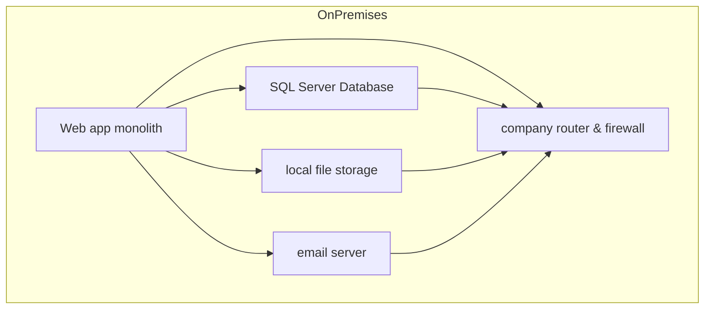

# Scenario Description

A mid-sized retail company currently runs a traditional on-premises solution consisting of:

- **Web Application:** Monolithic architecture hosted on physical servers  
- **Database:** Backend SQL Server  
- **File Storage:** Local file system  
- **Networking:** Managed by company-operated routers and firewalls  
- **Email Service:** Client notifications handled internally

| Component      | Potential Cloud Model | Reasoning                                                                 |
|----------------|---------------------|--------------------------------------------------------------------------|
| Web Application| PaaS / IaaS         | PaaS allows managed deployment, IaaS allows lift-and-shift with minimal changes by hosting the existing app on cloud VMS with **minimal** changes |
| Database       | PaaS / IaaS         | PaaS simplifies the maintenance process, backups, and scaling, IaaS offers more control initially by availing choice of OS, configuration and custom settings before moving to a fully managed PaaS environment |
| File Storage   | PaaS / IaaS         | Cloud storage (blob, S3) provides scalability and durability; IaaS can mirror existing setup by creating vms with attached volume storage volumes that replicate the current on prem file servers allowing the company to keep the same file structure(legacy compatibility) |
| Networking     | Cloud-native        | Use virtual networks, firewalls, load balancers, and routing in the cloud |
| Email Service  | SaaS          | SaaS email (like sendygrid or exchange online) reduces maintenance on various servers|

# migration Plan

## 1.web Application
- **strategy:** PaaS for managed app services like azure app service   
- **reasoning:** Reduces management overhead, auto-scaling, easy CI/CD integration  
- **alternative:** iaas if minimal code changes are desired thus performing a lift and shift migration

## 2.database
- **strategy:** PaaS database service
- **reasoning:** Automated backups, patching, and high availability  
- **hybrid Option:** Keep on iaas temporarily for complex stored procedures or heavy customization options

## 3.file Storage
- **strategy:** cloud storage PaaS like azure blob storage  
- **reasoning:** highly durable, scalable, and accessible from all the cloud applications
- **hybrid option:** you can initially keep file storage on IaaS vms to replicate the on premises setup while gradually moving some files to PaaS
  
## 4.networking
- **strategy:** cloud native networking using virtual networks, subnets, route tables, and most importantly the firewalls.  
- **reasoning:** Ensures secure connectivity between cloud resources, on-premises, and the internet.

## 5.email service
- **strategy:** saas to be used like Gmail for business 
- **Reasoning:** offloads email infrastructure maintenance and ensures high deliverability

# Migration Steps

1. **assessment:** evaluate dependencies and readiness of each component
2. **planning:** choose the target cloud services and map components
3. **rehosting (Lift and Shift):** move applications to IaaS for minimal changes  
4. **refactoring:** move applications to PaaS to leverage cloud native features  
5. **data migrating:** transfer databases and files using secure migration tools  
6. **testing:** validate functionality and performance in the cloud environment  
7. **optimization:** Implement auto-scaling, monitoring, and cost management

# Purpose of the Lab

The lab's objective is to assist me in comprehending cloud computing service models (IaaS, PaaS, and SaaS) and migration methods through the analysis of an actual on-premises scenario. I  have created migration plans, mapped components to relevant cloud services, designed the current architecture, and used Markdown and diagrams to document the solutions.

