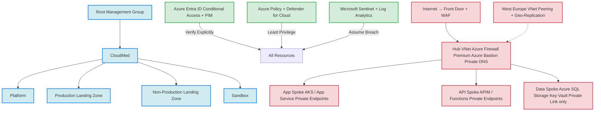

# Zero Trust Azure Landing Zone Design   
**CloudMed Solutions Inc.**  
*Secure, Compliant, and Scalable Healthcare Cloud Platform*

---

## 1 Company Overview 
**Cloudmed Solutions Inc.** is a healthcare technology company delivering a cloud native telemedicine and patient management platform (medconnect) to hospitals and clinics across north america and the UK 

**Core Services:**
- Secure Telehealth video sessions
- Electronic Medical Records Management
- AI driven clinical analytics / health authority requirements

  Since MedConnect Processes and stores highly sensitive protected health information and personal data across multiple jurisdictions , **Zero Trust is not optional rather it is mandatory** ASny breach of trust based perimeter security could result in catastrophic regul;atory fines , loss of customer trust and patient harm
  Adopting a full zero trust model in azure ensures that every request is authenticated and **Encrypted** regardless of the source location .
  
  ---

  ## 2. Governance and Identity

### Management Group Hierarchy

** IT IS AS A SNIPPET ON THIS FOLDER SAVED AS GROUPHIERARCHY.png** 

### Identity Documentation 
- **Azure Entra ID (formerly Azure AD)** as the single source of truth
- **Entra ID p1/p2** licenses for all employees and contractors
- **Conditional Access Policies** requiring:
- MFA (Phishing resistant is preferred)
- Compliant or Entra-joined devices
- Approved geographic locations (Canada, US , EU)
- Risk based sign in blocking
- **Privileged Identity Management** with just in time elevation for global administrator, subscription owner etc.
- Break glass account stored in an offline vault
### Role-Based Access Control (RBAC)
| Role Group         | Built-in Role                          | Scope                     | Activation |
|---------------------|----------------------------------------|---------------------------|------------|
| Cloud Admins        | Owner / contributor + PIM            | Platform & Landing Zones  | JIT (max 8h) |
| Security Team       | Security Administrator + Reader        | All subscriptions         | JIT        |
| DevOps Engineers    | Contributor (custom)                   | Specific App/API spokes   | Permanent  |
| Developers          | Reader + limited Contributor actions   | Dev/Test subscriptions    | Permanent  |
| Finance             | Cost Management Reader/Contributor     | All subscriptions         |            |

### Azure Policy(Enterprise policy as code)
- Enforce allowed regions : **Canada Central**, **West Europe** only
- Mandatory tags : Environment, application , DataClassification, CostCenter
- Deny Public IP creation on any resource
- Require private link for PaaS services
- Enforce diagnostics settings for log analytics
- require microsft defender for cloud plans

---

## Network Archhitecture - Hub and Spoke with zero trust 

### Topology Overview
  - **Hub Vnet** (Canada Central and west europe - peered)
  - Azure firewall premium (with IDPS and TLS inspection)
  - Private dns zones (Privatelink.*)
  - Azure Route Server (Future BGP needs)
- **Spoke VNets**
  - App Spoke (App Services, AKS, Front Door)
  - API Spoke (API Management, App Services, Functions)
  - Data Spoke (Azure SQL, Storage Accounts, Key Vault, Cosmos DB)
 ### Zero Trust Network Controls
| Control                            | Implementation                                      | Zero Trust Principle       |
|------------------------------------|-----------------------------------------------------|----------------------------|
| No public endpoints                | All PaaS uses Private Endpoints + VNet integration | Assume Breach              |
| East-West traffic inspection       | NSGs + Azure Firewall rules + Application Security Groups | Assume Breach              |
| Forced tunneling                  | UDR 0.0.0.0/0 → Azure Firewall                         | Assume Breach              |
| Private DNS resolution             | Private DNS zones linked to all VNets                  | Verify Explicitly          |
| Admin access                       | Azure Bastion only (no jump boxes, no public IPs)      | Least Privilege + Verify   |
| DDoS Protection                    | DDoS Standard on all public-facing VNets               | Assume Breach              |
    
## 4. Zero Trust Controls – Mapping to Core Principles

| Principle             | Design Implementation                                                                                 | Example Controls |
|-----------------------|-------------------------------------------------------------------------------------------------------|------------------|
| **Verify Explicitly** | Every human and non-human identity authenticated via Entra ID MFA + device compliance required     | Conditional Access Workload identities with Managed Identities Private Link + Entra auth for SQL |
| **Least Privilege**   | RBAC + PIM JIT No standing admin privileges Scoped roles only                                   | PIM for admins Custom RBAC for DevOps Managed Identity with only required permissions |
| **Assume Breach**     | Micro-segmentation, encryption everywhere, continuous monitoring                                     | Azure Firewall IDPS Private Endpoints only Defender for Cloud + Sentinel Immutable backups |

**Specific Design Examples**
1. **Azure Bastion Premium** → only way to administer VMs (no inbound RDP/SSH)
2. **Azure Private Link** for Azure SQL, Storage, Key Vault → never traverses public internet
3. **Azure Policy – “Deny public IP creation”** → enforces no accidental exposure
4. **Azure Firewall Premium with TLS inspection** → decrypts and inspects outbound traffic for DLP and threat protection
5. **Microsoft Defender for Cloud + Sentinel** → continuous assessment and automated response

---

## 5. Monitoring, Compliance, and Cost Management

| Area                | Tooling                                          | Key Features |
|---------------------|--------------------------------------------------|--------------|
| Centralized Logging | Log Analytics Workspace (in Management subscription) | 730-day retention for compliance |
| Security Posture    | Microsoft Defender for Cloud (all plans enabled) | Regulatory compliance dashboards (HIPAA, GDPR) |
| Threat Detection    | Microsoft Sentinel (SIEM + SOAR)                 | Healthcare-specific analytics rules |
| Compliance Reporting| Defender for Cloud + Azure Policy Guest Config   | Automated evidence collection |
| Cost Governance     | Azure Cost Management + Budgets + Tagging Policy | Alerts at 75%, 90%, 100% of budget |

---

## 6. Conceptual Diagram

---

- RED = network protection
- GREEN - Identity Verification
- BLUE - Monitoring and response

## This Zero Trust Azure Landing Zone will offer CloudMed Solutions: 

- Full compliance (HIPAA, GDPR, PIPEDA)
- Defense in depth with not a shred of implicit trust whatsoever
- Scalable hub-and-spoke architecture across two regions
- Centralized governance, centralized identity, centralized logging, cost management and centralized responsibility for future AKS, AI workloads, and regional expansion work

## Where This Implementation Could Be Bettered In The Future:

- Infrastructure as Code & GitOps deployment
- Deploy the entire landing zone using Bicep or Terraform + Azure DevOps or GitHub Actions with policy-as-code checks in CI/CD to prevent misconfigurations and mistakes.
- Azure Landing Zone Accelerator + ALZ Policies
- Switch to Microsoft Azure Landing Zones (ALZ) Bicep modules + the Enterprise-Scale ALZ policy set for easier collaboration with the community and upgrades in the future.

