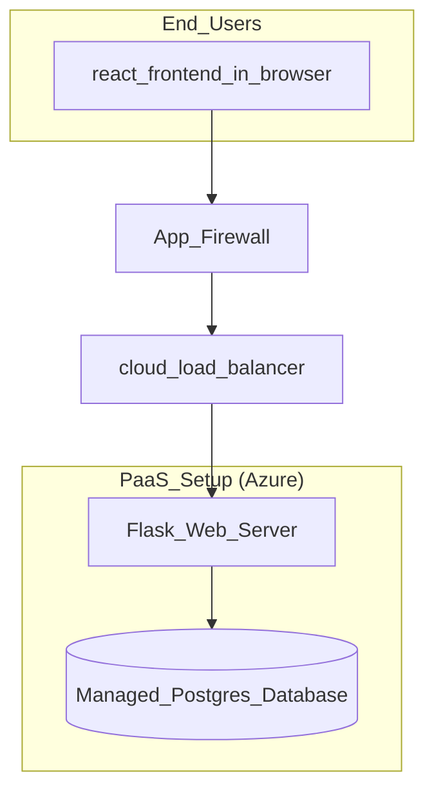
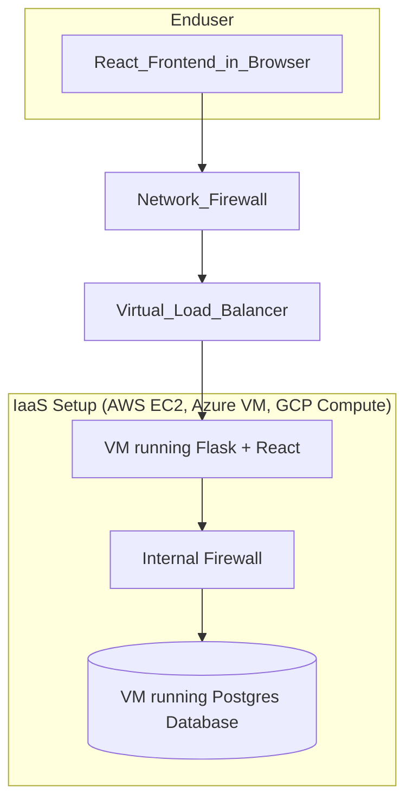
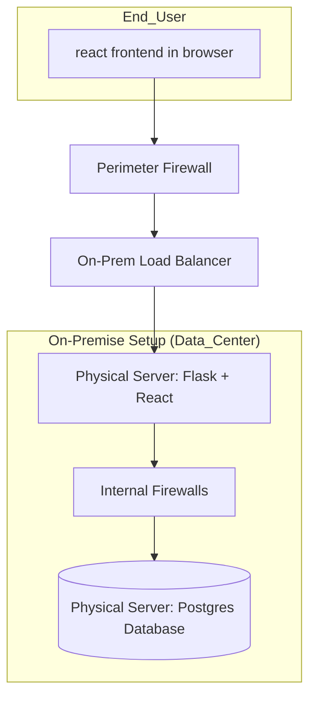

PaaS

Iaas

On-Prem

# Web Application Deployment Guide

This document describes how a web application consisting of a **React frontend**, **Flask backend**, and **Postgres database** can be deployed using different infrastructure models: **PaaS**, **IaaS**, and the one **On-Premises**.

---

## 1. Deployment on PaaS (Platform as a Service)

In a PaaS deployment, the cloud provider manages most of the infrastructure, allowing developers to focus primarily on the application and data. Providers include Heroku, Render, and Azure App Service.

- The **React frontend** runs in the users browser 
- The **Flask backend** is deployed as a managed application service  
- **Postgres** is provided as a managed database service by the cloud provider
- **Application-level firewalls** protect the services, and a **cloud load balancer** distributes incoming traffic automatically(prevent DDOS)

**Key Points:**  
- The cloud provider handles servers, operating system updates, scaling, and high availabilities
- Users focus on maintaining application code and database configuration
- Ideal for rapid deployment, simplified scaling, and reduced operational overhead

---

## 2. Deployment on IaaS (Infrastructure-as-a-Service)

In an Iaas deployment, virtual machines (VMs) are provisioned in a cloud environment such as AWS EC2, Azure Virtual Machines, or Google Cloud Compute Engine.

- The **React frontend** runs in the user's browser, while the **Flask backend** is hosted on a VM.  
- The **Postgres database** is hosted on a separate VM to isolate data and improve performance.  
- Security is implemented using **firewalls** at both the network perimeter and internally between the web server and database.  
- A **load balancer** distributes user traffic across one or more VMs running the web server, providing better availability and scalability.

**Key Pointers:**  
- The user manages the operating system, security patches, and software stack.  
- Offers flexibility to configure servers, network rules, and scaling policies manually.  
- Ideal for teams that need full control over infrastructure while leveraging cloud resources.

---

## 3. Deployment Using On-Premises Infrastructure

In an On-Premises setup, the application is hosted on physical servers located in the organization’s own data center.

- The **React frontend** runs in the user's browser.  
- The **Flask backend** and React components run on a dedicated physical server 
- **Postgres** runs on a separate physical server to ensure data isolation and reliability.  
- Security is enforced using **perimeter firewalls** and **internal firewalls** between the web server and database.  
- **Hardware load balancers** distribute traffic across web servers for performance and redundancy.

**Key Pointers:**  
- Full control over hardware, software, and network configuration 
- Ideal for organizations with strict compliance, security, or data residency requirements.  
- All responsibilities, including updates, backups, scaling, and security, fall on the organization.  
- Higher upfront costs and maintenance compared to cloud solutions

---

