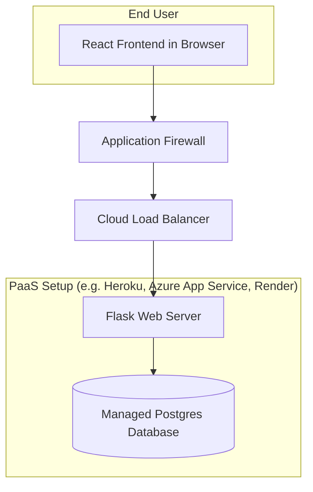
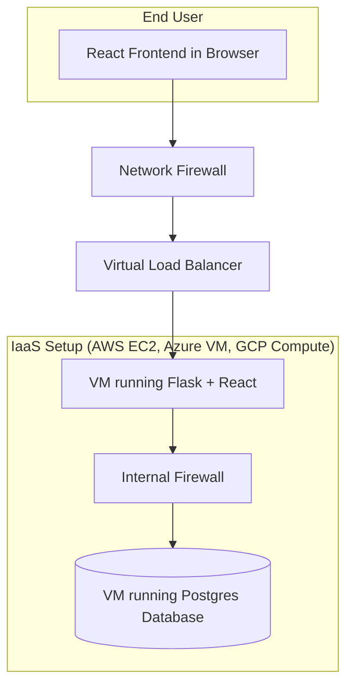
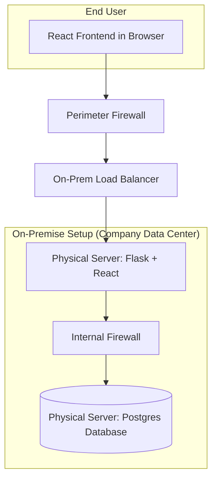

```mermaid
graph TB
    subgraph User["End User"]
        UI[React Frontend in Browser]
    end

    Firewall[Application Firewall]
    LoadBalancer[Cloud Load Balancer]

    subgraph PaaS["PaaS Setup (e.g. Heroku, Azure App Service, Render)"]
        AppServer[Flask Web Server]
        Database[(Managed Postgres Database)]
    end

    UI --> Firewall --> LoadBalancer --> AppServer
    AppServer --> Database
```
Iaas

```mermaid
graph TB
    subgraph User["End User"]
        UI[React Frontend in Browser]
    end

    PerimeterFW[Network Firewall]
    CloudLB[Virtual Load Balancer]

    subgraph IaaS["IaaS Setup (AWS EC2, Azure VM, GCP Compute)"]
        VM1[VM running Flask + React]
        InternalFW[Internal Firewall]
        VM2[(VM running Postgres Database)]
    end

    UI --> PerimeterFW --> CloudLB --> VM1
    VM1 --> InternalFW --> VM2
```
On-Prem

```mermaid
graph TB
    subgraph User["End User"]
        UI[React Frontend in Browser]
    end

    OuterFW[Perimeter Firewall]
    HardwareLB[On-Prem Load Balancer]

    subgraph OnPrem["On-Premise Setup (Company Data Center)"]
        Server1[Physical Server: Flask + React]
        InnerFW[Internal Firewall]
        Server2[(Physical Server: Postgres Database)]
    end

    UI --> OuterFW --> HardwareLB --> Server1
    Server1 --> InnerFW --> Server2
```

