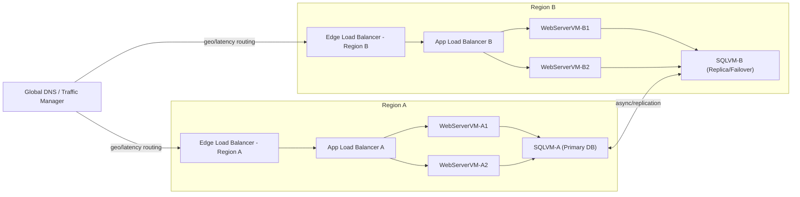

# Multi-Region Deployment with Load Balancing 

**Lab:** Lift-and-shift migration — WebServerVM + SQLVM (Multi-region with load balancing)

**Constraints:** Application downtime ≤ 6 hours. WebServerVM serves static frontend content. SQLVM hosts backend SQL database. Both are replicated across regions with an automatic failover system in place

# question1 — target architecture diagrams

## q2 : target architecture description (2 marks)

**High-level:**

* A global DNS/Traffic Manager provides geo/latency-based routing and health-check-based failover between Region A and Region b
* Each region runs a pair of WebServerVM instances behind a regional Application Load Balancer (ALB) for high availability and distribution of HTTP traffic
* Each region hosts a SQLVM; Region A contains the primary database while Region B hosts a continuously-replicated replica configured for automatic failover
* The web servers host static content and are treated as stateless — content is synchronized across regions (via object storage or rsync/immutable image) so any regional web nodes can serve requests

**redundancy & failover mechanisms:**

* **DNS / Global Traffic Manager:** Health checks the regional edge LB/ALB and will redirect traffic to the healthy region if one region fails.
* **Regional ALBs:** Spread traffic across at least two WebServerVM instances in each region (N+1 or active-active). If a VM fails, the ALB stops sending traffic to it.
* **Database replication & failover:** Configure asynchronous or semi-synchronous replication from Primary (Region A) → Replica (Region B). Use automated failover (e.g., managed DB failover groups or orchestrated failover script) so Region B can be promoted to Primary during regional outage.
* **Data synchronization for static content:** Use cross-region object storage (e.g., cloud blob storage with replication) or a CI/CD pipeline that deploys the same immutable web image to both regions.

**RPO / RTO considerations:**

* Aim for low RPO via near-real-time replication (semi-sync or low-lag async). To meet downtime requirement (≤6 hours), regularly test failover and ensure promotion procedures complete within SLA.

## Q3 — Migration steps (2 marks)

## 1 — Pre-migration preparation

1. Inventory current VMs (WebServerVM, SQLVM), their OS versions, installed software, storage sizes, and network/security settings.
2. Create target VPC/subnets, security groups, IAM roles, and necessary firewall rules in both regions.
3. Provision object storage and cross-region replication for static content.
4. Set up a staging environment in the secondary region.

## 2 VM replication across regions (lift-and-shift)

1. **Create images (golden/VM snapshots):** Take consistent snapshots of WebServerVM and SQLVM. For the database, prefer a database-aware backup (dump or snapshot with quiesce).
2. **Copy images to target region(s):** Import snapshots/images to Region B and instantiate VMs with identical machine types and provisioning.
3. **Boot and test VMs:** Start WebServerVMs in Region B, verify application config, static content, and health endpoints. Start SQLVM replica in Region B using DB restore or by initializing replication (see DB steps).
4. **Automate config drift prevention:** Use configuration management (Ansible, cloud-init, or image baking) to ensure identical configuration across regions.

## 3 Configure load balancers

1. **Regional ALBs:** Create ALB in each region and register the regional WebServerVM instances.
2. **Health checks:** Configure HTTP(S) health checks hitting `/health` or static endpoint. Set aggressive but safe health check intervals to enable quick detection.
3. **Global traffic manager / DNS:** Configure global DNS to perform latency/priority-based routing. Add health-check probes to detect regional outages and failover.
4. **Session handling:** As content is static and web servers are stateless, no sticky sessions required. If needed, use cookie-based or client-side session storage.

## 4 Database replication & failover

1. **Choose replication mode:** If using managed DB service, enable cross-region replicas / geo-replication feature. For self-managed SQLVM, configure native replication (e.g., SQL Server Always On Availability Groups, MySQL Group Replication, or PostgreSQL streaming replication) with a replica in Region B.
2. **Initial data sync:** Seed the replica by restoring a recent backup or snapshot and start replication to catch up to primary.
3. **Monitoring & failover automation:** Configure monitoring to detect lag and failure. Implement automatic failover using managed failover groups where available, or implement a runbook and scripts (with orchestrator) to promote the replica.
4. **Promote on failover:** On region outage, global DNS re-routes to healthy region; promote Region B DB to Primary and update application connection strings or use a connection endpoint/alias that abstracts primary endpoint.

## 5 Cutover and testing

1. Run failover drills to validate RTO/RPO, failover time is within 6 hours.
2. Validate application end-to-end in the target region (web + DB).
3. Monitor replication lag, LB health, and DNS propagation.

## 6 Rollback plan

 If migration issues occur, revert DNS to point to original region, restore primary DB from pre-migration backup snapshot, and re-register original VMs behind the ALB.

